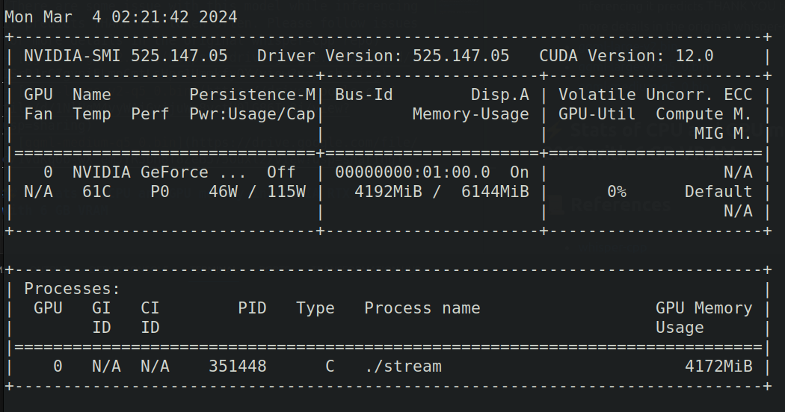

<div align="center">

# whispercpp-custom
[](https://github.com/pre-commit/pre-commit)

A clean and simple Custom Whisper cpp implementation for stream of audio data.

</div>

##  📌  Introduction
This is a simple reimplementaion of the Whisper cpp library. The original Whisper cpp library is a part of the [whisper-cpp](https://github.com/ggerganov/whisper.cpp.git).Here in this repo we have compiled a shared libra whisper.so from original whisper-cpp library and updated stream cpp implementation to use the shared library. We are going to go through the steps to build the shared library and use it in the stream cpp implementation.

##  📦  Prerequisites
- [CMake](https://cmake.org/download/)
- [Boost](https://www.boost.org/users/download/)
- [PortAudio](http://www.portaudio.com/download.html)

## 📁  Project Structure
The directory structure of new project looks like this:
```
├── include
│   ├── common.h
│   ├── common-sdl.h
│   ├── dr_wav.h
│   ├── format.h
│   ├── ggml-alloc.h
│   ├── ggml-backend.h
│   ├── ggml-cuda.h
│   ├── ggml.h
│   ├── grammar-parser.h
│   └── whisper.h
├── lib
│   └── libwhisper.so
├── models
│   └── ggml-large-v2.bin
├── README.md
└── src
    ├── common.cpp
    ├── common-sdl.cpp
    ├── format.cpp
    └── stream.cpp


## 🚀  Build

### 1. Build Whisper shared library
```bash
# Clone the whisper-cpp repo
git clone https://github.com/ggerganov/whisper.cpp.git

# Build the shared library for NVIDIA CUDA
cd whisper.cpp
WHISPER_CUBLAS=1 make libwhisper.so
```

### 2. Build the stream.cpp
```bash
# Clone the whispercpp-custom repo
git clone https://github.com/sh-aidev/whispercpp-custom.git

# Build the stream.cpp
cd whispercpp-custom
g++ -o stream src/stream.cpp src/common-sdl.cpp src/common.cpp src/format.cpp -lSDL2 -L ./lib -lwhisper -I/usr/include/SDL2 -D_REENTRANT

# to get the models you can download from the original whisper-cpp repo or click on the below provided links and put it in the models directory
# Run the stream
LD_LIBRARY_PATH=./lib ./stream -m models/ggml-large-v2.bin
```

## 📝  Models
- [ggml-large-v3.bin](https://drive.google.com/file/d/13WIDwdm-sI3kzF4WS82wfhhZsrZJiZsK/view?usp=sharing) (There are some issue with this model while inferencing it predicts THANK YOU token often. Please follow issues for more details in the original whisper-cpp repo)
- [ggml-large-v2.bin](https://drive.google.com/file/d/1SrDJrCZgvniFLmoCmtLsHpr1UmmkfyOX/view?usp=sharing)
- [ggml-large-v2-q5_0.bin](https://drive.google.com/file/d/1NlUqM4vyWAjGvjjuWm8yctU0lG86IvQj/view?usp=sharing)
- [ggml-medium-q5_0.bin](https://drive.google.com/file/d/1vdKqUb-wX_emJYR5bH8T8ZeB575Ouxl2/view?usp=sharing)

## ⚡️ Stats of GPU memory in NVIDIA RTX 2060 with 6 GB VRAM while inferencing large-v2 model



## 📜  References
- [whisper-cpp](https://github.com/ggerganov/whisper.cpp.git)
- [Text-to-ASCII](https://patorjk.com/software/taag/#p=display&f=Big&t=distrilled%20whisper%0A)
